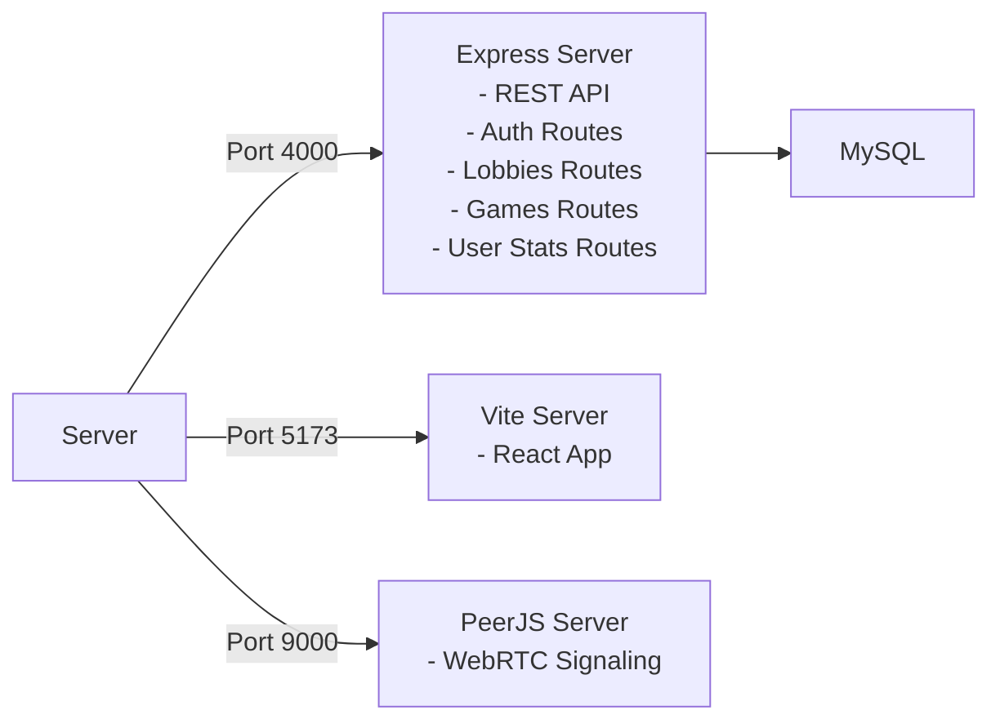
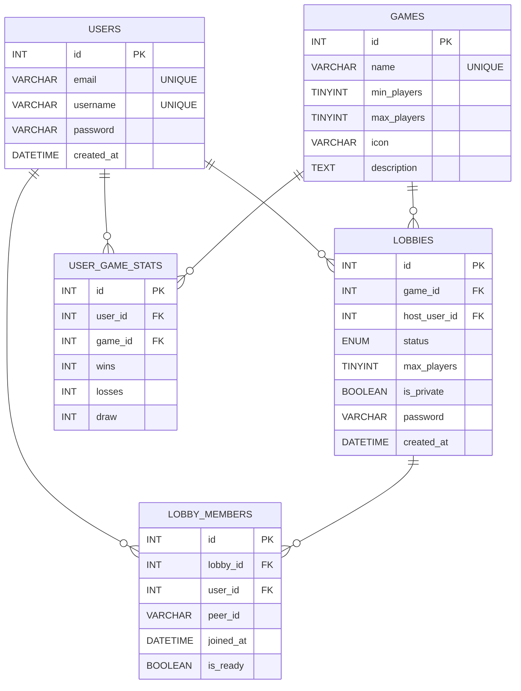

# GameHub - Project

**GameHub** is a complete P2P multiplayer game portal for LAN that uses **WebRTC** for real-time gameplay.

- Backend: **Node.js/Express + MySQL** to manage users, games, lobbies and stats
- Signaling: **PeerJS server** to coordinate WebRTC connections
- Frontend: **React 18 + Vite** with responsive UI
- Gameplay: **P2P direct** - the host is authoritative and broadcasts state

---

## 1. Requirements Specification

### Functional Requirements

**Authentication and Profile**
- User registration with unique email/password/username
- Login with validation
- Profile with global and per-game stats (wins, losses, draws)

**Lobby System**
- Display list of available lobbies (filtered by game)
- Create public or private lobbies (password)
- Join available lobbies
- Players can toggle "ready"
- Host can start match (transition from "Open" to "Playing")
- Auto-cleanup when players leave a lobby

**P2P Multiplayer Games**
- Tic-Tac-Toe (Tris) - 1v1
- Connect 4 - 1v1
- Rock-Paper-Scissors (best of 3)
- Guess the Number - 2-4 players, turn-based
- Automatic P2P connection via PeerJS
- Game state synced between players

**Result Saving**
- Host reports results to server
- Stats saved in database (wins/losses/draws per user/game)
- Stats available on profile

### Non-Functional Requirements

- LAN support: auto-detect IP
- Password hashed with bcrypt (10 rounds)
- Relational database (MySQL) with normalized schema
- Extendable for new games

---

## 2. System Design

### Folder Structure
```
GameHub/
    backend/
        index.js              # Express API + PeerJS server bootstrap
        db.js                 # MySQL connection pool
        routes/
            auth.js           # register/login/profile
            games.js          # list games + report results
            lobbies.js        # lobby CRUD/ready/start/update-peer/leave
        .env                  # DB config (committed in this repo)

    frontend/
        vite.config.js
        src/
            App.jsx           # top-level navigation (home/profile/game)
            config.js         # API base URL (dynamic via window.location.hostname)
            lib/usePeer.js    # PeerJS client hook (dynamic via window.location.hostname)
            components/
                LobbyModal.jsx    # lobby list + lobby room (ready/start)
                TrisGame.jsx
                Connect4Game.jsx
                RpsGame.jsx
                GuessNumberGame.jsx
                AuthModal.jsx
                ProfilePage.jsx
            styles/
                index.css
                games/
                    shared.css
                    tris.css
                    connect4.css
                    rps.css
                    guess-number.css

    schema.sql              # MySQL schema
    README.md
```

### Architecture



### P2P Gameplay
```
    PLAYER 1               PLAYER 2
    ═════════              ═════════
   Browser/PC1            Browser/PC2
       │                        │
       │◄───── WebRTC      ────►│
       │      (P2P Direct)      │
       │                        │
       └────► Game Data ◄───────┘
             (Host Authoritative)
```

### Technology Stack

- **Frontend**: React 18 (UI state management), Vite (build tool)
- **Backend**: Node.js 20+, Express (framework)
- **Database**: MySQL
- **Signaling + P2P**: PeerJS library + PeerJS server (`peer`)


### Main User Flow

```
LOGIN
  │
  ├─ Email + Password → POST /api/auth/login
  └─ Frontend stores user in React state
       │
       ▼
       User clicks "Play [Game]"
       │
       ├─ Modal opens: Lobby List
       ├─ Shows available lobbies (public + joined private ones)
       │
       ├─ Option A: Create Lobby
       │  └─ POST /api/lobbies/createlobby
       │     ├─ Creates lobby record
       │     ├─ Adds host to lobby_members (is_ready=true)
       │     └─ Redirects to Lobby Room
       │
       ├─ Option B: Join Existing Lobby
       │  ├─ Enter password if private
       │  └─ POST /api/lobbies/:id/join
       │     └─ Adds player to lobby_members
       │
       ▼
       Lobby Room Screen
       │
       ├─ Shows all players + ready status + seat
       ├─ Current player can toggle ready
       │  └─ POST /api/lobbies/:id/ready
       │
       ├─ Host can start game
       │  └─ POST /api/lobbies/:id/start
       │     ├─ Updates lobby status → "Playing"
       │     └─ Frontend reads this → transitions to Game
       │
       ├─ Both players update peer_id
       │  └─ POST /api/lobbies/:id/update-peer
       │
       ▼
       Game Screen (P2P)
       │
       ├─ Both create PeerJS clients
       ├─ Host waits for incoming connections
       │  └─ peer.on('connection', (conn) => { ... })
       ├─ Join players connect to host
       │  └─ peer.connect(hostPeerId)
       │
       ├─ Play game (state exchanged via conn.send())
       ├─ Host is authoritative (decides who wins)
       │
       ▼
       Game Over
       │
       ├─ Host reports result
       │  └─ POST /api/games/result
       │     ├─ Updates user_game_stats
       │     ├─ Increments wins/losses/draws
       │     └─ Uses INSERT ... ON DUPLICATE KEY UPDATE
       │
       ▼
       Return to Lobby or Games List
       │
       └─ Profile page shows updated stats
```

### Database Schema



### Backend API

#### Auth

- `POST /api/auth/register`  `{ email, password, username }` → register user
- `POST /api/auth/login`     `{ email, password }` → login user
- `GET  /api/auth/profile/:id` → get user profile

#### Games

- `GET  /api/games/games`  → list games
- `POST /api/games/result` → salva stati
	- supports 1v1 (`winner_user_id`/`loser_user_id`) e and multiplayer (`winner_user_ids`/`loser_user_ids`)
	- supports draws (`is_draw: true` and `player_user_ids`)

#### Lobbies

- `GET  /api/lobbies?game_id=<id>` → get lobbies
- `POST /api/lobbies/createlobby``{ game_id, host_user_id, max_players, peer_id, is_private, password }` → create lobby
- `POST /api/lobbies/:id/join` `{ user_id, peer_id, password }` → join lobby
- `GET  /api/lobbies/:id` → lobby info
- `GET  /api/lobbies/:id/members` → members
- `POST /api/lobbies/:id/ready` `{ user_id, peer_id? }` → toggle ready
- `POST /api/lobbies/:id/start` `{ user_id }` → start game
- `POST /api/lobbies/:id/update-peer` `{ user_id, peer_id }` → update peer_id
- `POST /api/lobbies/:id/leave` `{ user_id }` → leave lobby

---

## 3. Implementation

### Installation

**Prerequisites**
- Node.js 20+
- MySQL 8+
- Ports 4000, 5173, 9000 free

**Database**
```bash
mysql -u <user> -p <password>
CREATE DATABASE gamehub;
USE gamehub;
source schema.sql;
```

**Backend**
```bash
cd backend
npm install
# edit .env with DB creds
npm run dev
# Output: Server running on port 4000
#         PeerServer running on port 9000
```

**Frontend**
```bash
cd frontend
npm install
npm run dev
# Output: VITE v... ready in X ms
#         ➜ Local: http://localhost:5173
```

## 4. Testing

### User Test

The UI includes quick buttons “Play as User 1 / User 2” which attempt login with:

- `test@test` / password `test`
- `test2@test` / password `test`

```bash
curl -X POST http://localhost:4000/api/auth/register   -H "Content-Type: application/json"   -d '{"email":"test@test","password":"test","username":"Test1"}'
```

The passowords need to be hashed with bcrypt if inserted manually in database  
Or insert via API

### Manual Unit Tests

**API Health**
```bash
curl http://localhost:4000/ping
# {"ok":true}

curl http://localhost:4000/api/games/games
# [{ id: 1, name: "Tris", ... }, ...]
```

**User Management**
```bash
# Register
curl -X POST http://localhost:4000/api/auth/register \
  -H "Content-Type: application/json" \
  -d '{"email":"player1@test","password":"test123","username":"Player1"}'

# Login
curl -X POST http://localhost:4000/api/auth/login \
  -H "Content-Type: application/json" \
  -d '{"email":"player1@test","password":"test123"}'

# Profile
curl http://localhost:4000/api/auth/profile/1
```
