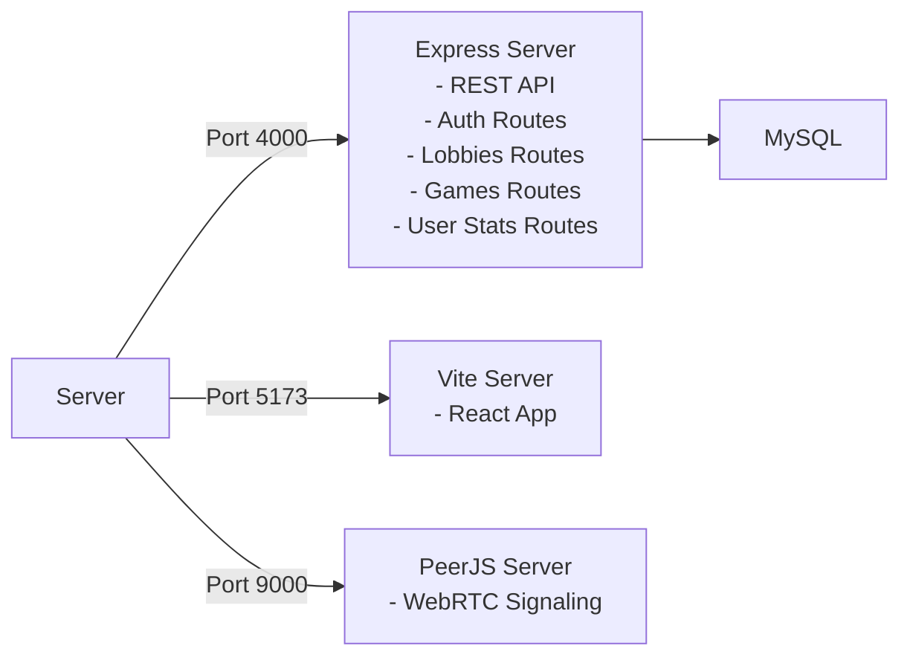
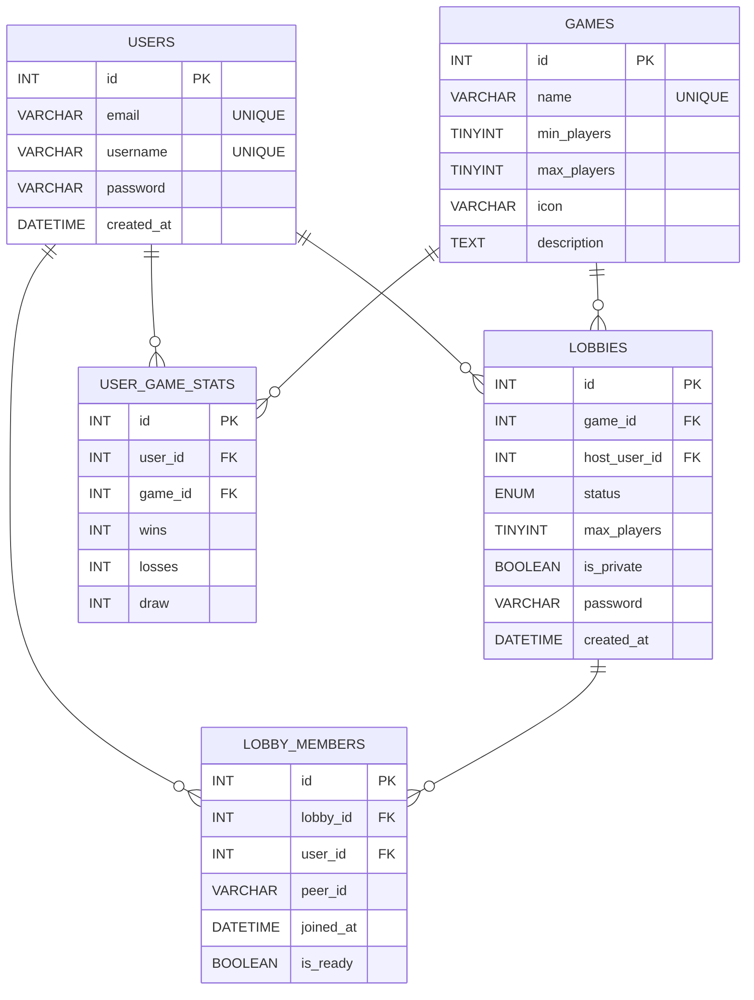

# GameHub - Progetto 

**GameHub** è un game portal multiplayer P2P completo per LAN che utilizza **WebRTC** per il gioco in tempo reale.

- Backend: **Node.js/Express + MySQL** per gestire utenti, giochi, lobby e statistiche
- Signaling: **PeerJS server** per coordinare connessioni WebRTC
- Frontend: **React 18 + Vite** con UI responsive
- Gameplay: **P2P direct** - l'host è autoritativo e trasmette lo stato

---

## 1. Specifica dei Requisiti

### Requisiti Funzionali

**Autenticazione e Profilo**
- Registrazione utenti con email/password/username unici
- Login con validazione
- Profilo con statistiche globali e per-gioco (wins, losses, draws)

**Lobby System**
- Visualizzare lista lobby disponibili (filtrate per gioco)
- Creare lobby pubbliche o private (con password)
- Unirsi a lobby disponibili
- Toggle "ready" per giocatori
- Host inizia la partita (transizione da "Open" a "Playing")
- Auto-cleanup quando giocatori lasciano lobby

**Giochi Multiplayer P2P**
- Tris (Tic-Tac-Toe) - 1v1
- Connect 4 - 1v1
- Sasso Carta Forbici (Rock-Paper-Scissors) - best of 3
- Indovina il numero (Guess the Number) - 2-4 giocatori, turn-based
- Connessione P2P automatica tramite PeerJS
- Game state sincronizzato tra giocatori

**Salvataggio Risultati**
- Host riporta risultati al server
- Stats salvate nel database (wins/losses/draws per utente/gioco)
- Statistiche disponibili nel profilo

### Requisiti Non-Funzionali

- Supporto LAN: IP auto-detect 
- Password viene hashata attraverso bcrypt (10 rounds)
- Database relazionale (MySQL) con schema normalizzato
- Estendibile per nuovi giochi

---

## 2. Progettazione del Sistema

### Struttura Cartelle 
```
GameHub/
	backend/
		index.js              # Express API + PeerJS server bootstrap
		db.js                 # MySQL connection pool
		routes/
			auth.js             # register/login/profile
			games.js            # list games + report results
			lobbies.js          # lobby CRUD/ready/start/update-peer/leave
		.env                  # DB config (committed in this repo)

	frontend/
		vite.config.js
		src/
			App.jsx             # top-level navigation (home/profile/game)
			config.js           # API base URL (dynamic via window.location.hostname)
			lib/usePeer.js      # PeerJS client hook (dynamic via window.location.hostname)
			components/
				LobbyModal.jsx    # lobby list + lobby room (ready/start)
				TrisGame.jsx
				Connect4Game.jsx
				RpsGame.jsx
				GuessNumberGame.jsx
				AuthModal.jsx
				ProfilePage.jsx
			styles/
				index.css
				games/
					shared.css
					tris.css
					connect4.css
					rps.css
					guess-number.css

	schema.sql              # MySQL schema
	README.md
```

### Architettura 


### P2P Gameplay
```
    PLAYER 1               PLAYER 2
    ═════════              ═════════
   Browser/PC1            Browser/PC2
       │                        │
       │◄───── WebRTC      ────►│
       │      (P2P Direct)      │
       │                        │
       └────► Game Data ◄───────┘
             (Host Authoritative)
```

### Stack Tecnologico

- **Frontend**: React 18 (UI state management), Vite (Build Tool)
- **Backend**: Node.js 20+ , Express (Framework)
- **Database**: MySQL (Database relazione)
- **Signaling + P2P**: PeerJS libreria + PeerJS server (`peer`)


### Flusso Principale Utente

```
LOGIN
  │
  ├─ Email + Password → POST /api/auth/login
  └─ Frontend save user in React State
       │
       ▼
       User clicks "Play [Game]"
       │
       ├─ Modal opens: Lobby List
       ├─ Shows available lobbies (public + joined private ones)
       │
       ├─ Option A: Create Lobby
       │  └─ POST /api/lobbies/createlobby
       │     ├─ Creates lobby record
       │     ├─ Adds host to lobby_members (is_ready=true)
       │     └─ Redirects to Lobby Room
       │
       ├─ Option B: Join Existing Lobby
       │  ├─ Enter password if private
       │  └─ POST /api/lobbies/:id/join
       │     └─ Adds player to lobby_members
       │
       ▼
       Lobby Room Screen
       │
       ├─ Shows all players + ready status + seat
       ├─ Current player can toggle ready
       │  └─ POST /api/lobbies/:id/ready
       │
       ├─ Host can start game
       │  └─ POST /api/lobbies/:id/start
       │     ├─ Updates lobby status → "Playing"
       │     └─ Frontend reads this → transitions to Game
       │
       ├─ Both players update peer_id
       │  └─ POST /api/lobbies/:id/update-peer
       │
       ▼
       Game Screen (P2P)
       │
       ├─ Both create PeerJS clients
       ├─ Host waits for incoming connections
       │  └─ peer.on('connection', (conn) => { ... })
       ├─ Join players connect to host
       │  └─ peer.connect(hostPeerId)
       │
       ├─ Play game (state exchanged via conn.send())
       ├─ Host is authoritative (decides who wins)
       │
       ▼
       Game Over
       │
       ├─ Host reports result
       │  └─ POST /api/games/result
       │     ├─ Updates user_game_stats
       │     ├─ Increments wins/losses/draws
       │     └─ Uses INSERT ... ON DUPLICATE KEY UPDATE
       │
       ▼
       Return to Lobby or Games List
       │
       └─ Profile page shows updated stats
```

### Schema Database



### Backend API 

#### Auth

- `POST /api/auth/register`  `{ email, password, username }` -> registra un utente
- `POST /api/auth/login`     `{ email, password }` -> login un utente
- `GET  /api/auth/profile/:id` -> ritorna il profilo del id utente

#### Games

- `GET  /api/games/games`  → lista dei giochi nel database
- `POST /api/games/result` → salva stati
	- supporta 1v1 (`winner_user_id`/`loser_user_id`) e anche multiplayer (`winner_user_ids`/`loser_user_ids`)
	- supporta draws (`is_draw: true` e `player_user_ids`)

#### Lobbies

- `GET  /api/lobbies?game_id=<id>`  -> lista delle lobby 
- `POST /api/lobbies/createlobby` `{ game_id, host_user_id, max_players, peer_id, is_private, password }` -> crea lobby
- `POST /api/lobbies/:id/join`    `{ user_id, peer_id, password }` -> entra una lobby
- `GET  /api/lobbies/:id`    -> ricevere info della lobby
- `GET  /api/lobbies/:id/members`    -> ricevere i giocatori della lobby
- `POST /api/lobbies/:id/ready`      `{ user_id, peer_id? }`   -> toggle stato ready
- `POST /api/lobbies/:id/start`      `{ user_id }`     -> start partita
- `POST /api/lobbies/:id/update-peer` `{ user_id, peer_id }`   -> aggiorna il peer_id se si perde
- `POST /api/lobbies/:id/leave`      `{ user_id }` -> abbandano lobby

---

## 3. Implementazione

### Installazione

**Prerequisiti**
- Node.js 20+ (`node -v`)
- MySQL 8+ (`mysql --version`)
- Porte disponibili: 4000, 5173, 9000

**Database**
```bash
mysql -u <user> -p <password>
CREATE DATABASE gamehub;
USE gamehub;
source schema.sql;
```

**Backend**
```bash
cd backend
npm install
# Aggiornare .env 
npm run dev
# Output: Server running on port 4000
#         PeerServer running on port 9000
```

**Frontend**
```bash
cd frontend
npm install
npm run dev
# Output: VITE v... ready in X ms
#         ➜ Local: http://localhost:5173
```


## 4. Testing

### Credenziali Test

Il UI , include 2 button "Play as User 1 / User 2" che accede come 2 utenti di test:

- `test@test` / password `test`
- `test2@test` / password `test`

Le password devono essere hashate con bcrypt se inserite manualmente nel database.  
O inserite via api

### Unit Tests (Manual)

**API Health**
```bash
curl http://localhost:4000/ping
# {"ok":true}

curl http://localhost:4000/api/games/games
# [{ id: 1, name: "Tris", ... }, ...]
```

**User Management**
```bash
# Register
curl -X POST http://localhost:4000/api/auth/register \
  -H "Content-Type: application/json" \
  -d '{"email":"player1@test","password":"test123","username":"Player1"}'

# Login
curl -X POST http://localhost:4000/api/auth/login \
  -H "Content-Type: application/json" \
  -d '{"email":"player1@test","password":"test123"}'

# Profile
curl http://localhost:4000/api/auth/profile/1
```